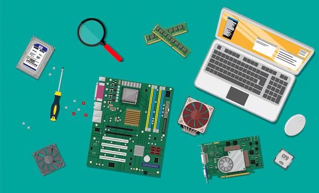

# leci_uaveiro

  

Trabalho desenvolvido durante a Licenciatura em Engenharia de Computadores e Informática no Departamento de Telecomunicações e Informática da Universidade de Aveiro.

## Índice

### 1º Ano

#### 1º Semestre
- [Fundamentos de Programação](1ano/sem1/fp)
- [Introdução aos Sistemas Digitais](1ano/sem1/isd)
- [Introdução à Engenharia Informática](1ano/sem1/iei)
- [Cálculo I - C](1ano/sem1/c1)
- [Álgebra Linear e Geometria Analítica - A](1ano/sem1/algaa)

#### 2º Semestre
- [Laboratórios de Sistemas Digitais](1ano/sem2/lsd)
- [Cálculo II - C](1ano/sem2/calculo2)
- [Matemática Discreta](1ano/sem2/md)
- [Laboratórios de Informática](1ano/sem2/li)
- [Programação Orientada a Objetos](1ano/sem2/poo)

### 2º Ano

#### 1º Semestre
- [Algoritmos e Estruturas de Dados](2ano/sem1/aed)
- [Arquitetura de Computadores - I](2ano/sem1/ac1)
- [Redes de Comunicações - I ](2ano/sem1/rc1)
- [Mecânica e Campo Eletromagnético](2ano/sem1/mce)
- [Competencias Transferíveis - I](2ano/sem1/cts)
  - [Design Thinking](2ano/sem1/cts/dt)
  - [Empreendedorismo e Novos Negócios](2ano/sem1/cts/empreendedorismo)
  - [Gestão de projetos](2ano/sem1/cts/gp)
